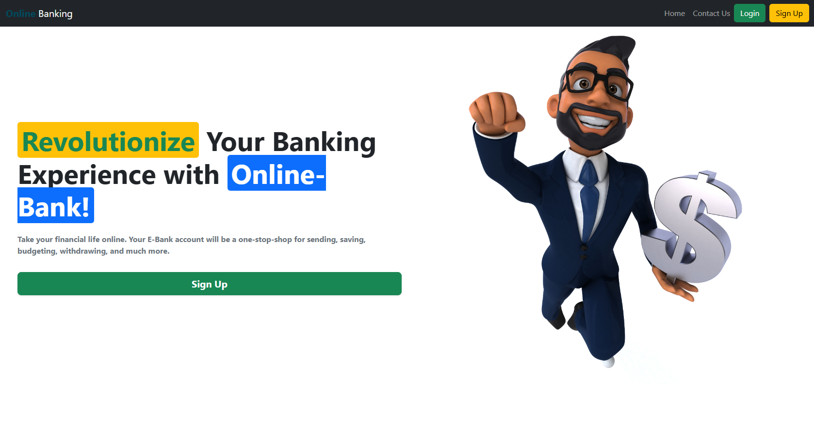

hg# **Banking System API** 🏦💻


This project is a **RESTful API** for a simple banking system. It allows users to **sign up**, **log in**, **manage their profiles**, **check balances**, **transfer money**, and **view transaction history**. The API is built using **Node.js**, **Express**, and **MongoDB**, with **JWT** for authentication.

---

## **Features** ✨
1. **User Authentication** 🔐:
   - Sign up with email, password, and name. 📝
   - Log in with email and password. 🔑
   - Log out by clearing the JWT token. 🚪

2. **Bank Account Management** 💳:
   - Automatically create a bank account with a default balance of **10,000** upon signup. 💰
   - Check account balance. 📊
   - Transfer money to another user using their email. 💸
   - View transaction history with pagination. 📜

3. **Profile Management** 👤:
   - View user profile (name, email, balance). 📋
   - Update profile (name and password). 🔄

4. **Security** 🛡️:
   - Passwords are hashed using **bcrypt**. 🔒
   - JWT tokens are used for secure authentication. 🔐
   - Cookies are used to store tokens securely. 🍪

---

## **Technologies Used** 🛠️

### **Frontend**
- **Framework**: React 🖥️
- **Routing**: React Router DOM 🗺️
- **State Management**: React Hooks 🪝
- **Styling**: Bootstrap 🎨
- **Toast Notifications**: React Toastify 🔔
- **Cookie Management**: js-cookie 🍪

### **Backend**
- **Runtime**: Node.js 🖥️
- **Framework**: Express 🚀
- **Database**: MongoDB 🗄️
- **Authentication**: JWT (JSON Web Tokens) 🔑
- **Password Hashing**: bcrypt 🔐

### **Development Tools**
- **Bundler**: Vite ⚡
- **Linting**: ESLint 📏
- **Environment Management**: dotenv 🔧

---

## **API Endpoints** 🌐

### **Authentication** 🔐
| **Endpoint**       | **Method** | **Description**                          | **Request Body**                                                                 |
|---------------------|------------|------------------------------------------|----------------------------------------------------------------------------------|
| `/api/auth/signup`  | POST       | Register a new user                      | `{ "email": "user@example.com", "password": "password123", "name": "John Doe" }` |
| `/api/auth/login`   | POST       | Log in an existing user                  | `{ "email": "user@example.com", "password": "password123" }`                     |
| `/api/auth/logout`  | POST       | Log out the user (clears JWT token)      | None                                                                             |

---

### **Bank Account** 💳
| **Endpoint**               | **Method** | **Description**                          | **Request Body**                                                                 |
|-----------------------------|------------|------------------------------------------|----------------------------------------------------------------------------------|
| `/api/bank/balance`         | GET        | Get the user's account balance           | None                                                                             |
| `/api/bank/transfer`        | POST       | Transfer money to another user           | `{ "receiverEmail": "receiver@example.com", "amount": 500 }`                     |
| `/api/bank/transactions`    | GET        | Get transaction history (paginated)      | Query Params: `?page=1` (default: 5)                                             |

---

### **Profile Management** 👤
| **Endpoint**               | **Method** | **Description**                          | **Request Body**                                                                 |
|-----------------------------|------------|------------------------------------------|----------------------------------------------------------------------------------|
| `/api/Manage/profile`       | GET        | Get user profile details                 | None                                                                             |
| `/api/Manage/profile`       | PUT        | Update user profile (name or password)   | `{ "name": "New Name", "password": "newpassword123" }` (optional fields)         |

---

## **How to Run the Project** 🚀

### **Prerequisites** 📋
1. Install **Node.js** and **npm**. 📥
2. Install **MongoDB** (local or cloud-based). 🗄️
3. Create a `.env` file in the root directory with the following variables:
   ```plaintext
   MONGO_URI=add Database URI
   JWT_SECRET=your_jwt_secret_key
   PORT=your port
   NODE_ENV=development
   ```

### **Steps** 🛠️
1. Clone the repository:
   ```bash
   git clone <repository-url>
   ```
2. Navigate to the project directory:
   ```bash
   cd <project-folder>
   ```
3. Install dependencies:
   ```bash
   npm install
   ```
4. Start the server:
   ```bash
   npm start
   ```

---

## **Security Features** 🛡️
- **Password Hashing**: Passwords are hashed using bcrypt before saving to the database. 🔒
- **JWT Authentication**: Tokens are signed with a secret key and expire after 7 days. 🔐
- **Secure Cookies**: Tokens are stored in HTTP-only cookies for enhanced security. 🍪
